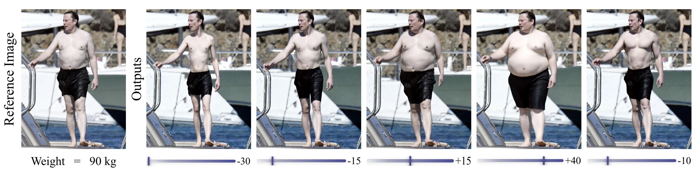
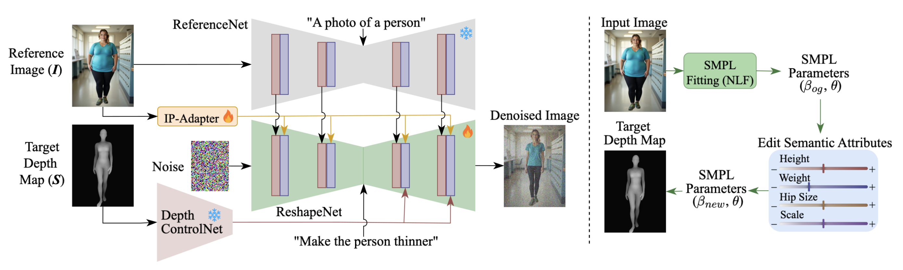

<div align="center">

# Odo: Depth-Guided Diffusion for Identity-Preserving Body Reshaping

**Siddharth Khandelwal &nbsp;·&nbsp; Sridhar Kamath &nbsp;·&nbsp; Arjun Jain**

Fast Code AI &nbsp;|&nbsp; WACV 2026

[](https://openaccess.thecvf.com/content/WACV2026/html/Khandelwal_Odo_Depth-Guided_Diffusion_for_Identity-Preserving_Body_Reshaping_WACV_2026_paper.html)
[](https://arxiv.org/abs/2508.13065)
[](https://huggingface.co/datasets/SridharKamath/ChangeLing18K)
[](LICENSE.txt)

</div>

<!-- Add a teaser once available: place the file at assets/teaser.png -->
<p align="center">
  
</p>

> **Odo** reshapes the human body in an image — making a person thinner, heavier, or more
> muscular — while preserving identity, clothing, pose, and background. Shape is controlled
> by adjusting semantic sliders that edit an SMPL body model; the resulting **target SMPL
> depth map** guides a diffusion model, optionally refined with a natural-language prompt
> such as *"make the person muscular."*

## Abstract

Human shape editing enables controllable transformation of a person's body shape, such as
thin, muscular, or overweight, while preserving pose, identity, clothing, and background.
Unlike human pose editing, which has advanced rapidly, shape editing remains relatively
underexplored. Current approaches typically rely on 3D morphable models or image warping,
often introducing unrealistic body proportions, texture distortions, and background
inconsistencies due to alignment errors and deformations. A key limitation is the lack of
large-scale, publicly available datasets for training and evaluating body shape
manipulation methods. In this work, we introduce the first large-scale dataset of 18,573
images across 1,523 subjects, specifically designed for controlled human shape editing. It
features diverse variations in body shape, including fat, muscular and thin, captured under
consistent identity, clothing, and background conditions. Using this dataset, we propose
**Odo**, an end-to-end diffusion-based method that enables realistic and intuitive body
reshaping guided by simple semantic attributes. Our approach combines a frozen UNet that
preserves fine-grained appearance and background details from the input image with a
ControlNet that guides shape transformation using target SMPL depth maps. Extensive
experiments demonstrate that our method outperforms prior approaches, achieving per-vertex
reconstruction errors as low as **7.5 mm**, significantly lower than the 13.6 mm observed
in baseline methods, while producing realistic results that accurately match the desired
target shapes.

## Method

<!-- Add the architecture figure (Fig. 5) at assets/architecture.png -->
<p align="center">
  
</p>

Odo builds on Stable Diffusion XL and is composed of four modules:

- **ReshapeNet** — the trainable base UNet that performs the denoising.
- **ReferenceNet** — a frozen SDXL UNet that extracts fine-grained appearance, clothing,
  and background features from the input image and injects them into ReshapeNet's
  self-attention (spatial feature concatenation).
- **IP-Adapter** — provides complementary high-level appearance features from the input
  image via decoupled cross-attention.
- **Depth ControlNet** — conditions the generation on the target SMPL depth map, driving
  the body-shape transformation.

Only ReshapeNet and the IP-Adapter are trained; ReferenceNet, the ControlNet, the VAE, and
the text/image encoders are frozen.

## Installation

Python 3.10, CUDA 11.8, and an Ampere-or-newer GPU (bf16) are recommended.

```bash
pip install torch==2.0.1+cu118 torchvision==0.15.2+cu118 torchaudio==2.0.2+cu118 \
    --index-url https://download.pytorch.org/whl/cu118
pip install -r requirements_minimal.txt   # requirements.txt is the full frozen environment
pip install -e .                           # puts `odo`, `nlf`, `posepile` on the path
```

SMPL fitting uses [NLF](https://github.com/isarandi/nlf). After installing, point its body
models at your local directory by editing `model_root` in
`.../site-packages/smplfitter/common.py`.

## Dataset — ChangeLing18K

ChangeLing18K contains **18,573** identity-consistent transformation pairs across **1,523**
subjects (thin ↔ fat ↔ muscular) with matched identity, clothing, pose, and background,
plus a **3,600**-pair evaluation benchmark with distinct identities.

📦 **Download:** [🤗 SridharKamath/ChangeLing18K](https://huggingface.co/datasets/SridharKamath/ChangeLing18K)

```bash
huggingface-cli download SridharKamath/ChangeLing18K --repo-type dataset --local-dir ./ChangeLing18K
```

The dataloader expects, under each data root, a `transformation_pairs.json` mapping each
image id to its `[source_category, target_category]` pairs, with images under
`<category>/images/` and precomputed SMPL depth maps in a parallel depth directory.

## Checkpoints

<!-- TODO: add pretrained checkpoint links once released -->
> 🤖 **Pretrained models:** *coming soon.*

Checkpoints are saved in the diffusers layout (`OdoPipeline`) plus an
`ip_adapter_weights.bin`; load them with `--pretrained_model_name_or_path <checkpoint-dir>`.

## Training

```bash
accelerate launch scripts/train.py \
    --gradient_checkpointing --use_8bit_adam --mixed_precision="bf16" \
    --output_dir=results --calc_smpl_metric \
    --train_batch_size=4 --report_to="wandb" \
    --train_data_dir <train_root> --val_data_dir <val_root> \
    --train_depth_images_path <train_depths> --val_depth_images_path <val_depths>
```

`--calc_smpl_metric` enables the PVE-T-SC shape metric during validation (requires the NLF
SMPL estimator via `--smpl_estimator_path`). Training runs on a single A100 (80 GB); the
paper trains for 60 epochs at 768×1024 (`--num_train_epochs 60`).

## Inference

```bash
python scripts/infer.py \
    --pretrained_model_name_or_path <checkpoint-dir> \
    --root_dir <images> --depth_images_path <depth-maps> \
    --output_dir <out>
```

## Ablations

The paper's Table 2 ablations are **configuration flags on the same scripts** — no separate
branches. Use the same flag(s) at both training and inference time.

| Configuration | Flags |
|---|---|
| Odo (full) | *(defaults)* |
| w/o prompts | `--prompt_mode generic` |
| w/o ReferenceNet | `--no-use_referencenet` |
| with BR-5K data | `--dataset br5k --train_data_dir <br5k_root> --train_depth_images_path <br5k_depths>` |

- `--use_referencenet` / `--no-use_referencenet` (default on) — toggles ReferenceNet feature
  injection; when off, the model relies on the IP-Adapter alone.
- `--prompt_mode {category,generic}` (default `category`) — `generic` uses *"A photo of a
  person"* for every pair.
- `--dataset {changeling,br5k}` (default `changeling`) — selects the dataset (BR-5K expected
  in the ChangeLing on-disk layout; adapt `BR5KDataset` in `odo/data/dataset.py` otherwise).

## Evaluation

```bash
python -m odo.metrics.pve   # PVE-T-SC + LPIPS / PSNR / SSIM over an output folder
```

Baselines: `scripts/run_kontext_baseline.py` runs the FLUX.1-Kontext comparison.

## Results

Evaluation on the ChangeLing18K benchmark (↑ higher is better, ↓ lower is better):

| Method | SSIM ↑ | PSNR ↑ | LPIPS ↓ | PVE-T-SC ↓ (mm) |
|---|---|---|---|---|
| Ren et al. | 0.6790 | 17.4567 | 0.2363 | 13.6337 |
| FLUX.1 Kontext [dev] | 0.6788 | 16.5195 | 0.2826 | 19.1911 |
| **Odo (ours)** | **0.7701** | **19.0080** | **0.2151** | **7.5214** |
| Odo w/o prompts | 0.7281 | 15.1745 | 0.2566 | 9.8032 |
| Odo w/o ReferenceNet | 0.6035 | 13.9982 | 0.4625 | 9.4157 |
| Odo w/ BR-5K data | 0.6939 | 14.1581 | 0.3432 | 18.6143 |

## Repository structure

```
odo/
  models/       ReshapeNet, ReferenceNet, IP-Adapter (SDXL modules)
  pipelines/    OdoPipeline
  data/         ChangeLing18KDataset, inference dataset, dataset tools
  metrics/      image metrics (LPIPS/PSNR/SSIM) + PVE-T-SC
scripts/        train / infer / baseline entry points
nlf/ posepile/  SMPL estimation (vendored from isarandi/nlf, isarandi/PosePile)
```

## Acknowledgements

Odo builds on excellent open-source work: [IDM-VTON](https://github.com/yisol/IDM-VTON) and
🤗 [diffusers](https://github.com/huggingface/diffusers) (SDXL, ReferenceNet/IP-Adapter
machinery), [ControlNet](https://github.com/lllyasviel/ControlNet) and the
[SDXL depth ControlNet](https://huggingface.co/xinsir/controlnet-depth-sdxl-1.0),
[IP-Adapter](https://github.com/tencent-ailab/IP-Adapter), and
[NLF](https://github.com/isarandi/nlf) for SMPL estimation. The dataset pipeline uses
FLUX.1, PuLID, RT-DETRv2, and SAM 2.1. We thank the authors of these projects.

## Citation

If you find Odo or ChangeLing18K useful, please cite:

```bibtex
@InProceedings{Khandelwal_2026_WACV,
    author    = {Khandelwal, Siddharth and Kamath, Sridhar and Jain, Arjun},
    title     = {Odo: Depth-Guided Diffusion for Identity-Preserving Body Reshaping},
    booktitle = {Proceedings of the IEEE/CVF Winter Conference on Applications of Computer Vision (WACV)},
    month     = {March},
    year      = {2026},
    pages     = {22-31}
}
```

## License

Released under [CC BY-NC-SA 4.0](LICENSE.txt) — for **non-commercial research use**. The
code inherits components from IDM-VTON and other projects; please also respect their
respective licenses.
